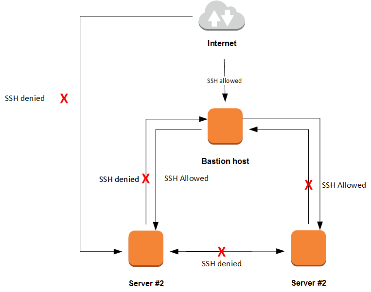

# IaC &raquo; Implementing the Bastion Host pattern
> CloudFormation template defining an EC2 server that acts as a Bastion Host for an application server

## Description
A *SSH bastion host* (aka *jumpbox*) is a server that can be accessed via SSH from the Internet by a specific range of IP addresses, while all other servers in the application are inaccessible via SSH except by the bastion host. 

This approach has 2 advantages:
+ You only have one entry point into your system, and that entry point features no business application (only SSH).
+ If one of your app servers is hacked, the attacker won't be able to jump from that hacked server to the other servers.
Template that defines a Bastion Host EC2 server that can be used to jump to an application server.

In the example, a CloudFormation template is defined that provisions an infrastructure with a Bastion Host and an Application Server. The Application Server features a Security Group that only allows SSH connections from the Security Group bound to the Bastion Host, thus enforcing that only the Bastion Host can SSH into it.

**Note**
You can obtain your public IPv4 address using the endpoint: https://api.ipify.org/
