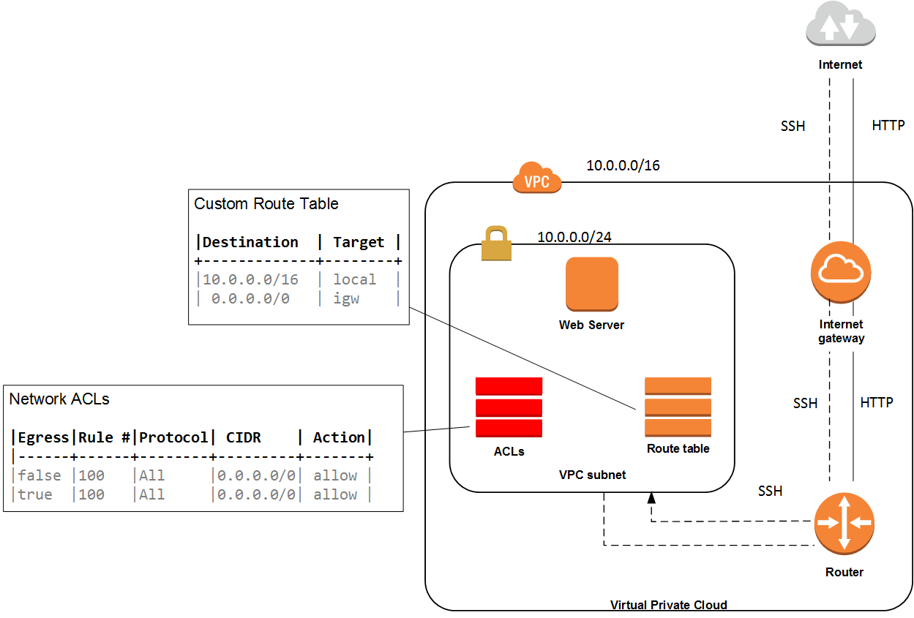

# IaC &raquo; Hello VPC
> CloudFormation template provisioning a complete VPC infrastructure that creates a nondefault VPC hosting a public facing EC2 instance

## Description
The example illustrates how to provision a nondefault VPC, a Subnet, an Internet Gateway, a Route Table and Network ACLs.

The template:
+ Creates a non-default VPC with single public subnet.
+ Creates a security group that allows traffic on some specific Ports
+ Launchs the EC2 server with a public DNS allows SSH traffic into it from a particular IPv4 and HTTP traffic from the Internet. The virtual server can also access the Internet.

As a consequence of this infrastructure:
+ A non-default VPC will be created, with a subnet, and Internet Gateway, and Route tables and ACLs
+ A security group for the web server allowing sshing from a particular IP address, and allowing HTTP communications on port 80
+ A web server EC2 instance that allows SSH from a particualr IP address, that serves a web pages on http 80 to the outside world and that allows the server to communicate with the outside world as well.