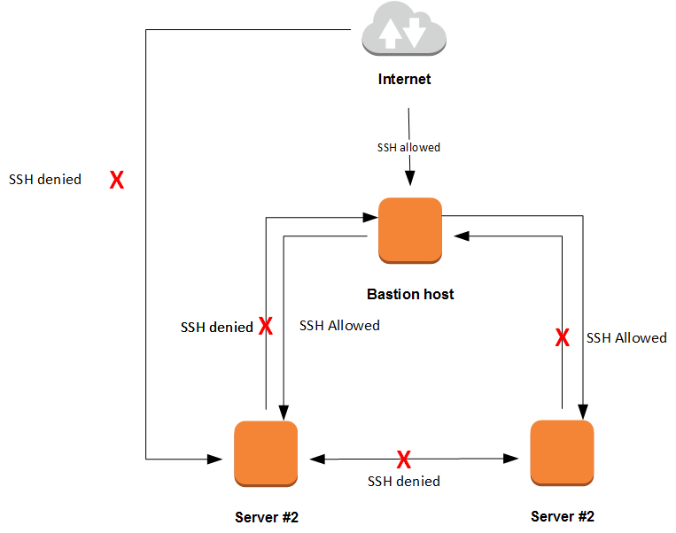

# Networking on AWS
> all things related to networking on AWS

## Table of Contents
+ [Introduction](#Introduction)
+ [Security Groups: AWS Firewall Rules](#security-groups-aws-firewall-rules)
  + [Implementing a Bastion Host with Security Groups](#implementing-a-bastion-host-with-security-groups)
+ [Creating a Private Network on AWS: VPC](#creating-a-private-network-on-aws-vpc)
  + [Introducing VPC and Subnets](#introducing-vpc-and-subnets)
  + [Internet Gateway](#internet-gateway-igw)
  + [The Configuration of a Default VPC](#the-configuration-of-a-default-vpc)

## Introduction
Amazon enables you to define a virtual network that closely resembles a traditional network. When you start an EC2 virtual server, you run it on a particular network, subnet and with a particular set of firewall rules that control the traffic that enter or leave your instance.

In order to interact with AWS networking services and components it is recommended to read through [**basic networking concepts**](basic-networking-concepts.md) to review some basic addressing and IPv4 concepts.

## Security Groups: AWS Firewall Rules
As a basic security measure, you only want traffic to enter or leave your EC2 instance that has to do so.

A firewall is used to control such traffic incoming (inbound, ingress, ingoing) and also outgoing traffic (outbound, egress). Before network traffic can enter or leave your EC2 instance, it goes through a firewall provided by AWS whic inspects the network traffic and uses rules to decide whether the traffic is allowed or denied.

A network package typically includes a *Source IP address* and a *Destination IP address* and *Destination Port* and uses an specific protocol, such as *TCP*. If the firewall includes a rule that allows *TCP* traffic on the given *Port* between the source and the destination the package will be allowed. Otherwise, the package will be discarded and will never reach its destination.

The AWS firewall rules lets you use both IP addresses and security groups, allowing you to filter inbound/outbound traffic from a disparate set of IP address ranges controlled by the instances belonging to a particular security group.

A security group is the equivalent of a firewall rule. It is configured with the following data:
+ `Direction` &mdash; inbound or outbound
+ `IP protocol` &mdash; TCP, UDP, ICMP, &hellip;
+ `Source/Destination IP address`
+ `Port`
+ `Source/Destination Security Group` &mdash; This only affects EC2 servers

For example, to allow ICMP inbound traffic so that your instance is capable of responding to ping commands you'll have to do:
```yaml
  AllowInboundICMPSecurityGroup:
    Type: "AWS::EC2::SecurityGroup"
    Properties:
      GroupDescription: "Security Group that allows ICMP traffic"
      VpcId: !Ref VPC
      SecurityGroupIngress:
        - IpProtocol: icmp
          FromPort: -1
          ToPort: -1
          CidrIp: "0.0.0.0/0"
```

Now the instance will respond to `ping` command, but you won't be able to *ssh* into it.

In order to do that, you will have to update the template to also allow SSH traffic:
```yaml
...
  AllowInboundICMPSecurityGroup:
    Type: "AWS::EC2::SecurityGroup"
    Properties:
      GroupDescription: "Security Group that allows ICMP traffic"
      VpcId: !Ref VPC
      SecurityGroupIngress:
        - IpProtocol: icmp
          FromPort: -1
          ToPort: -1
          CidrIp: "0.0.0.0/0"
  
  AllowInboundSSHSecurityGroup:
    Type: "AWS::EC2::SecurityGroup"
    Properties:
      GroupDescription: "Security Group that allows SSH traffic"
      VpcId: !Ref VPC
      SecurityGroupIngress:
        - IpProtocol: tcp
          FromPort: 22
          ToPort: 22
          CidrIp: "0.0.0.0/0"

  EC2Instance:
    Type: "AWS::EC2::Instance"
    Properties:
      InstanceType: "t2.micro"
      SecurityGroupIds: 
        - !Ref AllowInboundICMPSecurityGroup
        - !Ref AllowInboundSSHSecurityGroup
      KeyName: !Ref KeyName
      ImageId: !FindInMap [ AWSRegionToAMI , !Ref "AWS::Region", ubuntu64bit ]
      SubnetId: !Ref Subnet
...      
```

Up till now, we've used *security groups* that allow inbound traffic coming from any IP address. However, you can also restrict inbound traffic for a specific ip address:
```yaml
...
  IpForSSH:
    Description: "Select the IP address from which you will be able to SSH into the instance"
    Type: "String"
...
# The Actual infrastructure resources
Resources:

  # Security Groups for the server
  AllowInboundICMPSecurityGroup:
    Type: "AWS::EC2::SecurityGroup"
    Properties:
      GroupDescription: "Security Group that allows ICMP traffic"
      VpcId: !Ref VPC
      SecurityGroupIngress:
        - IpProtocol: icmp
          FromPort: -1
          ToPort: -1
          CidrIp: "0.0.0.0/0"
  
  AllowInboundSSHSecurityGroup:
    Type: "AWS::EC2::SecurityGroup"
    Properties:
      GroupDescription: "Security Group that allows SSH traffic"
      VpcId: !Ref VPC
      SecurityGroupIngress:
        - IpProtocol: tcp
          FromPort: 22
          ToPort: 22
          CidrIp: !Join ["", [ !Ref IpForSSH, "/32" ] ]

  EC2Instance:
    Type: "AWS::EC2::Instance"
    Properties:
      InstanceType: "t2.micro"
      SecurityGroupIds: 
        - !Ref AllowInboundICMPSecurityGroup
        - !Ref AllowInboundSSHSecurityGroup
      KeyName: !Ref KeyName
      ImageId: !FindInMap [ AWSRegionToAMI , !Ref "AWS::Region", ubuntu64bit ]
      SubnetId: !Ref Subnet
...      
```

You can control network traffic based on whether the source or destination belongs to a specific security group. This is useful, for example, if you want your database server to be accessed only by traffic coming from your web server.

### Implementing a Bastion Host with Security Groups
Let's use that capability to implement an *SSH bastion host* (aka *jumpbox*). When using this pattern, only one server, the bastion host can be accessed via SSH from the internet by a specific range of IP addresses, while all other servers can only be accessed via SSH from the bastion host. 
This approach has 2 advantages:
+ You only have one entry point into your system, and that entry point features no business application (only SSH).
+ If one of your app servers is hacked, the attacker won't be able to jump from that hacked server to the other servers.




On AWS, the bastion host pattern can be easily implemented by:
+ Allowing SSH access from `0.0.0.0/0` (or better a source of address ranges) to the bastion EC2 server
+ Allowing SSH access to the other servers only if traffic is coming from the bastion host

Using *CloudFormation* this can be done using the following approach (see [Bastion Host Recipe](../../04-iac/07-bastion-host/) for the complete recipe):
```yaml
...

  # Security Group Public: The security group to be used in the Bastion host
  SecurityGroupPublic:
    Type: "AWS::EC2::SecurityGroup"
    Properties:
      GroupDescription: "Security Group for filtering public traffic"
      VpcId: !Ref VPC

  # Rule for allowing ICMP for a given IPv4 address
  AllowInboundICMP:
    Type: "AWS::EC2::SecurityGroupIngress"
    Properties:
      GroupId: !Ref SecurityGroupPublic
      IpProtocol: icmp
      FromPort: -1
      ToPort: -1
      CidrIp: !Join ["", [ !Ref IpForSSH, "/32" ] ]

  # Rule for allowing SSH for a given IPv4 address
  AllowInboundSSH:
    Type: "AWS::EC2::SecurityGroupIngress"
    Properties:
      GroupId: !Ref SecurityGroupPublic
      IpProtocol: tcp
      FromPort: 22
      ToPort: 22
      CidrIp: !Join ["", [ !Ref IpForSSH, "/32" ] ]

  # The Security Group to be used in the application servers
  SecurityGroupPrivate:
    Type: "AWS::EC2::SecurityGroup"
    Properties:
      GroupDescription: "Security Group defined for filtering out public traffic"
      VpcId: !Ref VPC
  
  # Rule for allowing SSH into the application servers
  AllowPrivateInboundSSH:
    Type: "AWS::EC2::SecurityGroupIngress"
    Properties:
      GroupId: !Ref SecurityGroupPrivate
      IpProtocol: tcp
      FromPort: 22
      ToPort: 22
      SourceSecurityGroupId: !Ref SecurityGroupPublic

  BastionHost:
    Type: "AWS::EC2::Instance"
    Properties:
      InstanceType: "t2.micro"
      SecurityGroupIds: 
        - !Ref SecurityGroupPublic
      KeyName: !Ref KeyName
      ImageId: !FindInMap [ AWSRegionToAMI , !Ref "AWS::Region", ubuntu64bit ]
      SubnetId: !Ref Subnet      

  AppServer1:
    Type: "AWS::EC2::Instance"
    Properties:
      InstanceType: "t2.micro"
      SecurityGroupIds: 
        - !Ref SecurityGroupPrivate
      KeyName: !Ref KeyName
      ImageId: !FindInMap [ AWSRegionToAMI , !Ref "AWS::Region", ubuntu64bit ]
      SubnetId: !Ref Subnet
...
```
**NOTES**
+ Instead of directly bounding the rules to the *Security Groups*, we create an empty security group, and then bound the rules to the recently defined security group.
This makes the definition of the security groups more reusable.
+ To be able to connect from the *Bastion host* to the *Application server* you will have to make the keypair of the application server available in the bastion host. You can use `scp` for that:
```bash
$ scp -v -i aws-in-action-key-pair.pem aws-in-action-key-pair.pem  ubuntu@ec2-52-14-76-96.us-east-2.compute.amazonaws.com:/home/ubuntu/
```
Alternatively, you can use an SSH capability known as *Agent Forwarding*. This will let you authenticate with the same key you used to log in to the bastion host for further SSH logins.
This requires the following steps:
1. Add the private key to the SSH agent
```bash
$ ssh-add aws-in-action-key-pair.pem
Identity added: aws-in-action-key-pair.pem (aws-in-action-key-pair.pem)
```
2. Connect to the bastion host using the `-A` flag that enables forwarding of the authentication agent connection.
```bash
$ ssh -i aws-in-action-key-pair.pem -A ubuntu@${bastion-ip-address}
```
3. Now you can connect to the application server bypassing authentication:
```bash
# From the bastion host
$ ssh ${appserver-ip-address}
```

**Note**
After having added the private key identity to the authentication agent, you will no longer need to use `-i aws-in-action-key-pair.pem` to SSH into EC2 servers configured with that key.
```bash
$ ssh ubuntu@${bastion-ip-address}
```

You can list the identities that have been added to the authentication agent by using `ssh-add -l`, and you can remove the recently added key by typing `ssh-add -d aws-in-action-key-pair`.


## Creating a Private Network on AWS: VPC
AWS Virtual Private Cloud (VPC) allows you to create private (`10.0.0.0/8`, `172.16.0.0/12` or `192.168.0.0/16`) networks on AWS that are not necessarily connected to the public Internet. Within a VPC you can create subnets, route tables, access control lists (ACLs) and gateways to the Internet or a VPN endpoint.
The concept of subnet allows you to separate concerns: there should be subnet for databases, web servers, caching servers, etc. Another rule of thumb is that you should have at least two subnets: public and private. A public subnet has access to the Internet, while a private one hasn't. A web server should be in a public subnet, while a database should be in a private one.

Let's have a small deep-dive on the concepts behind Amazon VPC concepts before we tackle some implementation examples.

### Introducing VPC and Subnets
A *Virtual Private Cloud (VPC)* is a virtual network dedicated to your AWS account. It is logically isolated from other virtual networks in the AWS cloud. Within a VPC you can select its IP address range, create subnets for different purposes, configure route tables, network gateways and security settings.

A *subnet* is a range of IP addresses in your VPC. You can have two types of subnets:
+ public subnets &mdash; for resources that must be connected to the Internet (e.g. web servers)
+ private subnets &mdash; for resources that won't be connected to the Internet (e.g. Db server)

To protect AWS resources in each subnet you can use multiple layers of security, including *security groups* and network *access control lists (ACL)*.

Each account comes with a default VPC that has a default subnet in each Availability Zone. Thanks to that, you can launch instances without needing to know anything about VPC.

### Internet Gateway (IGW)
The default VPC includes an Internet gateway, and each default subnet is a public subnet. Therefore, each instance launched into the default subnet has a private IPv4 address and a public IPv4 address. These instances can communicate with the Internet through the Internet gateway.

By default, each instance launched into a non-default subnet has a private IPv4 address, but no public IPv4 address, unless you specifically assign one at launch, or modify the subnet's public IP address attribute. These instances can communicate with each other but won't be able to connect to the Internet.

You can also enable Internet access for an instance launched into a non-default subnet by attaching an Internet gateway to its VPC and associating an Elastic IP address with the instance. This will allow two-way communication to the instance.

Alternatively, to allow an instance in your VPC to initiate outbound connections but prevent unsolicited inbound connections, you can use a *network address translation (NAT)* device for IPv4 traffic. Using NAT you can map multiple private IPv4 addresses to a single IPv4 address. A NAT device has an elastic IP address and is connected to the Internet through an Internet gateway. You can connect an instance in a private subnet to the Internet through the NAT device, which will route traffic from the instance to the Internet gateway, and will also route any responses to the instance.

### The Configuration of a Default VPC
Let's take a look at the default VPC configuration for a recently created account for the `us-east-2` (Ohio) region:
+ VPC (default), CIDR: 172.31.0.0/16, assigned DHCP options set, Route Table, Network ACL
+ Subnets: 
  + 172.31.0.0/20, in AZ 2a, same route table as VPC, same ACL table as VPC, default subnet, auto-assign public IP: YES
  + 172.31.16.0/20, in AZ 2b, same route table as VPC, same ACL table as VPC, default subnet, auto-assign public IP: YES
  + 172.31.32.0/20, in AZ 2c, same route table as VPC, same ACL table as VPC, default subnet, auto-assign public IP: YES
+ Route Tables: attached to VPC, not explicitly associated to specific subnets
  + Route 1: 172.31.0.0/16, target: local &mdash; allows access between instances in the different VPC subnets
  + Route 2: 0.0.0.0/0, target: Internet gateway (IGW)
+ Internet Gateway: attached to VPC
+ DHCP Options set: the rules used to assign names to the EC2 servers
+ Network ACLs: attached to VPC and its subnets
  + Inbound Rules:
    + Rule #100 &mdash; ALL Traffic &mdash; ALL Protocol; &mdash; ALL Ports mdash; Source=0.0.0.0/0 &mdash; ALLOW
    + Rule *    &mdash; ALL Traffic &mdash; ALL Protocol; &mdash; ALL Ports mdash; Source=0.0.0.0/0 &mdash; DENY
  + Outbound Rules:
    + Rule #100 &mdash; ALL Traffic &mdash; ALL Protocol; &mdash; ALL Ports mdash; Source=0.0.0.0/0 &mdash; ALLOW
    + Rule *    &mdash; ALL Traffic &mdash; ALL Protocol; &mdash; ALL Ports mdash; Source=0.0.0.0/0 &mdash; DENY
+ Security Groups:
  + Inbound: allow traffic coming from instances in the VPC (associated to default security group)
  + Outbound: allow all traffic


**NOTE: Regions and Availability Zones**
Follow [Regions and Availability Zones](../99-misc/main.md#regions-and-availability-zones) for more information on the subject.
